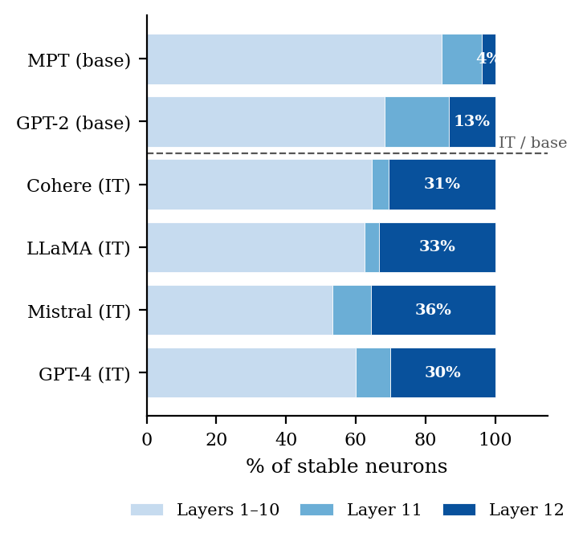
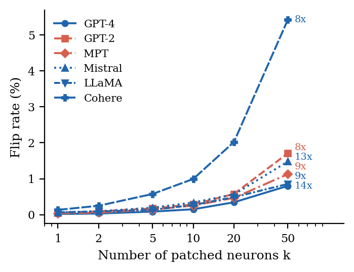
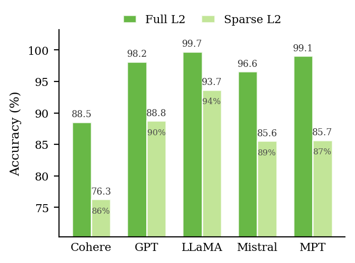
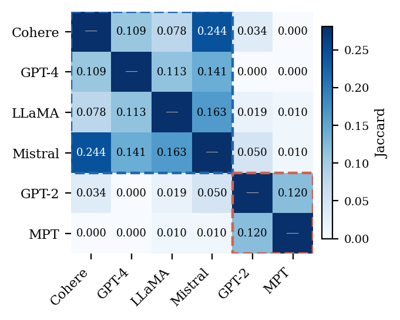

# AI-Text Detection Neurons in Frozen BERT

Code and result data for **“A Mechanistic Study of AI-Text Detection Neurons in Frozen BERT: Sparse Probing and Activation Patching on RAID”** — EMNLP 2026.

A **frozen** BERT-base-uncased (no fine-tuning) already separates AI-generated from human text. We ask *where* that signal lives. Applying an L1→L2 sparse-probing protocol to all 9,216 CLS hidden-state dimensions (12 layers × 768), three things fall out:

- **It is sparse.** 45–62 neurons — **under 0.7%** of the representation — carry the signal, stably across 5 folds × 3 seeds.
- **It is causal but not load-bearing.** Patching those neurons flips predictions **10–16× more often** than size-matched random sets. Yet *ablating* them costs ≤0.11pp accuracy for five of six generators — the signal is sufficient, not necessary.
- **Its geometry splits by post-training.** Instruction-tuned generators concentrate stable neurons in **layer 12** (30–36%); base generators avoid it (4–13%).

<table>
<tr>
<td width="50%"></td>
<td width="50%"></td>
</tr>
<tr>
<td><b>Where the neurons live.</b> Instruction-tuned generators put 30–36% of their stable neurons in BERT’s final layer; the two pure-base generators put 4–13% there.</td>
<td><b>That they matter.</b> Flip rate rises with the number of patched neurons; the annotated ratios are selected-set flips over size-matched random sets.</td>
</tr>
</table>

## Results at a glance

Every number below is from the paper, reproduced by the code in this repository. Val acc and AUC are the L2 evaluation probe on all 9,216 neurons; flip rates are forward (AI → human) at *k* = full.

| Generator | Post-training | Val acc | AUC | Stable neurons | % of 9,216 | Flip (selected) | Flip (random) | Ratio | Layer 12 |
|---|---|---|---|---|---|---|---|---|---|
| GPT-4 | SFT+RLHF | 0.988 | 0.999 | 60 | 0.65% | 1.23% | 0.08% | **16×** | 30% |
| LLaMA-2-Chat | SFT+RLHF | 0.986 | 0.998 | 48 | 0.52% | 1.07% | 0.11% | 10× | 33% |
| Cohere-Command | SFT+RLHF | 0.905 | 0.968 | 62 | 0.67% | 8.15% | 0.79% | 10× | 31% |
| Mistral-7B-Instruct | SFT only | 0.971 | 0.995 | 45 | 0.49% | 1.73% | 0.12% | 14× | 36% |
| GPT-2 | base | 0.959 | 0.992 | 60 | 0.65% | 3.13% | 0.32% | 10× | 13% |
| MPT-30B | base | 0.972 | 0.994 | 52 | 0.56% | 1.52% | 0.14% | 11× | 4% |

**Mean ablation** (necessity): removing the selected set costs +0.03 to +0.11pp accuracy for five generators — within noise. Cohere is the lone exception at **+1.06pp**, consistent with its signal being less localised.

**Leave-one-family-out** (generalisation): a probe restricted to the stable set retains **86–94%** of the full-feature ceiling on *held-out generator families* it never saw during selection — 76.3–93.7% absolute.

<table>
<tr>
<td width="50%"></td>
<td width="50%"></td>
</tr>
<tr>
<td><b>It transfers.</b> Full-feature vs sparse probe per held-out family, with retention annotated.</td>
<td><b>But the sets are family-specific.</b> Instruction-tuned pairs overlap far more with each other than with base generators.</td>
</tr>
</table>

## Quickstart — reproduce every figure in under a minute

This repository ships the result summary JSONs, so **all four figures above regenerate from a fresh clone in seconds**, with no dataset, no GPU, and no multi-hour run:

```bash
uv sync
uv run _paper/gen_figures.py
```

That writes both PDF (for the paper) and PNG (for this README) into `_paper/figures/`, and prints the underlying numbers as it goes. It is the only path that works without the dataset — everything below needs the full pipeline.

## Install

Requires Python ≥ 3.10; `uv sync` fetches 3.11 automatically if your system Python is older. `uv.lock` pins exact versions of all 117 resolved packages. `requirements.txt` carries the same direct dependencies as ranges for `pip` users.

```bash
uv sync
```

Verify the environment before committing to a long run:

```bash
uv run python -m compileall -q raid_pipeline raid_analysis scripts extra_analyses
uv run python -c "import raid_pipeline, raid_analysis; print('ok')"
```

**GPU (optional — speeds up activation extraction only).** `uv.lock` pins the CPU build of `torch`, so install the CUDA build *after* syncing, not before:

```bash
uv sync
uv pip install torch --torch-backend=cu124
```

A later `uv sync` restores the locked CPU build; re-run the second command if that happens. Every stage except activation extraction is CPU-bound, so this is genuinely optional.

## Data

RAID is **not redistributed here** — the download script fetches it. RAID is MIT-licensed and published by [Dugan et al. (2024)](https://aclanthology.org/2024.acl-long.674/).

```bash
uv run scripts/download_raid.py
```

This streams the ~12 GB RAID train CSV from HuggingFace, keeps only clean (non-adversarial) rows, and writes per-(domain, model) CSVs to `data/raw/raid/`. No token is needed — the dataset is public. Set `HF_TOKEN` in a `.env` file (see `.env.example`) only if you hit rate limits.

> **Budget tens of minutes to a few hours.** It streams the whole 12 GB to keep ~660 MB. This is the longest single step and is *not* in the runtime table below, which starts once data is on disk.

> **The download is not resumable and leaves no completion marker.** It writes CSVs incrementally, so an interrupted run leaves truncated files that later steps consume as if complete, silently corrupting results. The only success signal is a `DOWNLOAD COMPLETE` line. If a run is interrupted for any reason, start over:
> ```bash
> rm -rf data/raw/raid && uv run scripts/download_raid.py
> ```

Then tokenize and cache activations. **Both steps run once per generator** — repeat for each of the six (or all eleven, for the LOGO experiment):

```bash
uv run scripts/tokenize_raid.py --model gpt4
uv run scripts/extract_activations.py \
    --tokenized-path data/processed/raid_gpt4 \
    --output results/activations_raid_gpt4
```

Substitute the generator in all three places — `--model <G>`, `data/processed/raid_<G>`, `results/activations_raid_<G>` — using underscores where the generator name has a hyphen (`mistral-chat` → `raid_mistral_chat`).

### Disk budget

The streamed CSV is ~12 GB, but far less lands on disk:

| What | Size |
|---|---|
| `data/raw/raid/` (clean rows, all 11 generators) | ~660 MB |
| `data/processed/` (tokenized, all 11 generators) | ~2.1 GB |
| `results/activations_raid_<G>/` | ~350 MB per generator |
| Experiment outputs (`.npy` probe weights, splits) | ~110 MB per full run |

Budget roughly **8 GB** for the six main-body generators, or **~13 GB** for all eleven (needed for LOGO).

## Reproducing the paper

Six generators carry the main results: `gpt4 gpt2 mpt mistral-chat llama-chat cohere-chat`. LOGO additionally needs all eleven, since it holds out whole model families.

`sparse_probe` must run before anything that depends on it. `run_all.py` resolves that ordering:

```bash
uv run scripts/experiments/run_all.py \
    --generators gpt4 gpt2 mpt mistral-chat llama-chat cohere-chat
```

This is a multi-hour job. It prints a `run_id` at the start — **keep it**, for the reason in the next section.

| Paper | What | Command |
|---|---|---|
| **Table 1** | Sparse-probe results, 6 generators | `uv run scripts/experiments/run_experiment.py sparse_probe --generator <G>` |
| **Table 2**, **Fig 2** | Forward flip rates; flip rate vs *k* | `uv run scripts/experiments/run_experiment.py patching --generator <G>` |
| **Table 3** | Mean-ablation accuracy drop | `uv run scripts/experiments/run_experiment.py ablation --generator <G>` |
| **Fig 3**, **§6.2**, **Tables 9/11/12**, **Fig 5** | Layer distribution, Jaccard, CAV diagnostics | `uv run scripts/experiments/run_experiment.py characterize` |
| **Fig 4**, **Table 4** | Leave-one-family-out generalisation | `uv run scripts/experiments/run_logo.py` |
| **Table 5** (App B) | Stability sweep over (C, N) | `uv run scripts/experiments/run_sample_size_stability.py` |
| **Table 6** (App C) | Per-cell L2-probe metrics | `sparse_probe` output at `results/experiments/<run_id>/sparse_probe/<G>/seed_*/fold_*/eval_metrics.json` |
| **Table 7** (App D) | AUC-ROC vs L1 selection | `uv run scripts/experiments/run_experiment.py auc_comparison --generator <G>` |
| **Table 8** (App E) | Restricted probe | `uv run scripts/experiments/run_experiment.py restricted_probe --generator <G>` |
| **Table 10** (App G) | Per-domain patching breakdown | `patching` output at `results/experiments/<run_id>/patching/<G>/seed_*/fold_*/eval_metrics.json` |
| **Table 13** (App J) | Full bidirectional *k*-sweep | `patching` and `patching_human_into_ai` output, same paths |
| **Table 14** (App K) | Neuron–surface-feature association | `uv run extra_analyses/experiments/exp_08_neuron_feature_correlation.py` |
| **App L** | Worked patching example | `uv run extra_analyses/experiments/exp_02_worked_example.py` |

`uv run scripts/experiments/run_experiment.py --list` shows the available experiment names.

Configuration lives in `config/experiments/*.yaml`: 5 folds × 3 seeds (42, 123, 456), `max_samples: 7500`, `C=0.005`, stability threshold 0.8. The choice of `C` is itself justified by Table 5’s sweep.

### Run IDs, and a gotcha worth knowing

Each invocation writes to `results/experiments/<run_id>/`, auto-generated from a timestamp unless you pass `--run-id`. Dependent experiments find their upstream run via `--source-dir` (or `source_experiment` in the YAML).

**Three scripts hardcode the published run directories** — `_paper/gen_figures.py` (lines 12–13) and both `extra_analyses/experiments/exp_*.py`. They read `20260510_rerun_main` and `20260513_190517`, which is why the shipped figures regenerate out of the box. If you re-run the pipeline, either pass `--run-id 20260510_rerun_main` so your output lands where those scripts look, or edit the paths at the top of each file.

The two `extra_analyses` scripts additionally need `.npy` intermediates (probe weights, cached activations) from a completed `sparse_probe` and `patching` run. Those are **not** shipped — only summary JSONs are — so both fail with a bare `FileNotFoundError` on a fresh clone. That is expected, not a bug.

## Runtime and hardware

From the paper’s reported budget, on a laptop (AMD Ryzen 5 5600H, RTX 3060 Laptop, 6 GB VRAM):

| Stage | Time | Bound by |
|---|---|---|
| Activation extraction, 45,000 samples | ~30 min | GPU |
| Six per-generator main runs, incl. *k*-sweep | ~5 h | CPU |
| Multi-generator stability grid | ~1 h | CPU |
| LOGO across five family folds | ~15 min | CPU |
| **Full pipeline** | **~7–8 h** | |

BERT-base (110M) runs inference-only throughout — nothing is fine-tuned. After the initial encoding pass everything operates on cached representations, so a GPU helps only the first stage.

## Layout

```
raid_pipeline/      RAID loading, tokenization, BERT activation extraction
raid_analysis/      Library: data, selection (L1/AUC), evaluation (probe,
                    ablation, patching, confound), experiment framework
scripts/            Entry points: data prep and experiment drivers
config/experiments/ YAML config, one per experiment
extra_analyses/     Appendix K and L analyses, with their result JSONs
results/            Published summary JSONs (figures regenerate from these)
_paper/             LaTeX source, figures, and gen_figures.py
```

Two pieces ship that back no table in the paper, kept because they are honest parts of the analysis rather than because a claim depends on them: the **`confound`** experiment (`config/experiments/confound.yaml`, `raid_analysis/evaluation/confound.py`), which tests the selected neurons against text-length and domain confounds, and **`raid_analysis/evaluation/causal.py`**, shared machinery for ablation and patching rather than a standalone experiment.

## Citation

```bibtex
@inproceedings{blicharz-grunwald-2026-detection-neurons,
  title     = {A Mechanistic Study of {AI}-Text Detection Neurons in Frozen {BERT}:
               Sparse Probing and Activation Patching on {RAID}},
  author    = {Blicharz, Pawe{\l} and Grunwald, Mi{\l}osz},
  booktitle = {Proceedings of the 2026 Conference on Empirical Methods in Natural
               Language Processing},
  year      = {2026}
}
```

Paper source is in [`_paper/`](_paper/) (`main.tex`, `refs.bib`, `main.pdf`).

## Licence

MIT — see [LICENSE](LICENSE). RAID is separately MIT-licensed by its authors; no RAID text or model weights are redistributed here.
